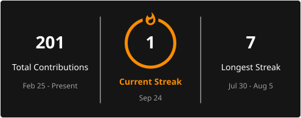

<!-- README.md — Kornu Venkata Santosh Kumar -->
<!-- Optimised for: GitHub profile, ATS systems, recruiters in DS/ML/AI/Analytics -->

<div align="center">


</div>

---

<div align="center">

[](https://venkatakornu-eng.github.io/)
[](https://www.linkedin.com/in/kornu-venkata-santosh-kumar-675009232)
[](mailto:venkatasantoshk29@gmail.com)
[](#)
[](#)

</div>

---

## 👤 Professional Summary

> **MSc Data Science candidate (University of Leicester)** with hands-on experience building end-to-end ML pipelines, deep learning models, and business-ready data dashboards. Proven ability to translate complex datasets into actionable insights — from cleaning 213,000+ public-sector records to achieving **96% classification accuracy** on medical datasets. Previously interned at **Vodafone Idea Foundation (_VOIS)** applying AI and LLMs to real-world analytics problems.

```python
profile = {
    "name"        : "Kornu Venkata Santosh Kumar",
    "degree"      : "MSc Data Science — University of Leicester, UK",
    "background"  : "B.Tech ECE — IIIT Kalyani, India",
    "experience"  : "Data Analytics Intern @ Vodafone Idea Foundation (_VOIS)",
    "focus"       : ["Machine Learning", "Deep Learning", "NLP", "Predictive Analytics"],
    "seeking"     : "Data Scientist | ML Engineer | Data Analyst — UK & Global",
    "availability": "Immediate · Open to Remote / Hybrid / Relocation",
    "visa"        : "UK Student Visa (Tier 4) · PSW Graduate Visa Eligible",
}
```

---

## 🎯 Current Focus

| Area | What I'm Building |
|------|-------------------|
| 🤖 **Machine Learning** | Production-ready classification and regression pipelines |
| 🧠 **Deep Learning** | LSTM / GRU / CNN architectures for time series & image data |
| 💬 **NLP & LLMs** | Text classification, RAG pipelines, prompt engineering, Multi-Agent Architecture |
| 📊 **Analytics & BI** | Interactive dashboards with Tableau, Power BI & Excel |
| ☁️ **MLOps** | Model deployment, monitoring, and versioning workflows |

---

## 🚀 Featured Projects

### 🔬 [Breast Cancer Prediction using Machine Learning](https://github.com/venkatakornu-eng/Breast-Cancer-Prediction-using-Machine-Learning)
> **Healthcare ML · Classification · Ensemble Methods**

- Led a 3-person team benchmarking Logistic Regression, Random Forest, SVM, and Neural Networks on clinical data
- Applied **SMOTE oversampling**, k-fold cross-validation, and grid search hyperparameter tuning
- Achieved **96% classification accuracy** with high recall — minimising false negatives critical in medical diagnosis
- `Python` · `Scikit-learn` · `TensorFlow` · `SMOTE` · `Matplotlib`

---

### 🚦 [Data-Driven Traffic Prediction (LSTM · GRU · MLP)](https://github.com/venkatakornu-eng/Data-Driven-Traffic-Prediction-using-Machine-Learning-and-Artificial-Intelligence-)
> **Deep Learning · Time Series Forecasting · Neural Architecture Comparison**

- Designed and benchmarked three deep learning architectures on real traffic sensor data
- Implemented early stopping, learning-rate scheduling, and systematic hyperparameter optimisation
- Reduced **RMSE by 15%** vs baseline; achieved **89% prediction accuracy** across test sequences
- `Python` · `PyTorch` · `LSTM` · `GRU` · `MLP` · `Time Series`

---

### 🛡️ [FraudSentinel — Real-Time Fraud Detection](https://github.com/venkatakornu-eng/FraudSentinel)
> **Financial ML · Imbalanced Data · Ensemble Classifiers**

- Built an end-to-end fraud detection pipeline handling severe class imbalance with SMOTE + cost-sensitive learning
- Ensemble approach (Random Forest + Gradient Boosting) optimised for precision-recall trade-off
- Designed for real-time inference with low false-positive rate
- `Python` · `Scikit-learn` · `SMOTE` · `Ensemble Methods` · `Feature Engineering`

---

### 🩺 [Diabetes Risk Modelling](https://github.com/venkatakornu-eng/Diabetes-Risk-Modelling)
> **Healthcare Analytics · Clinical ML · AUC-ROC Optimisation**

- Developed a supervised classification pipeline for early diabetes risk stratification
- Applied data imputation, feature selection, and comparison across Logistic Regression, RF, and GBM
- Evaluated on AUC-ROC and precision-recall curves for clinical reliability
- `Python` · `Scikit-learn` · `Gradient Boosting` · `EDA` · `Feature Engineering`

---

### 🏛️ [Birmingham Council Spending Analysis](https://github.com/venkatakornu-eng/birmingham-spending-analysis)
> **Public Sector Analytics · Data Wrangling · Business Intelligence**

- Cleaned and reconciled **213,000+ transaction records** across multiple council departments
- Built an interactive Excel dashboard with Pivot Tables, KPI cards, and department-level drill-downs
- Surfaced that Housing accounted for **26% of total council spend** — actionable for budget planning
- `Excel` · `Pivot Tables` · `Data Wrangling` · `EDA` · `Data Storytelling`

---

## 🛠️ Technical Skills

### 💻 Programming Languages


### 🤖 Machine Learning & AI


**Methods:** `Regression` · `Classification` · `Clustering` · `LSTM` · `GRU` · `CNN` · `NLP` · `Time Series` · `Feature Engineering` · `Hyperparameter Tuning` · `Cross-Validation` · `SMOTE` · `Ensemble Methods` · `RAG` · `LLM Prompting`

### 🗄️ Databases


### 📊 Data Visualisation & BI


### ☁️ Cloud & Tools


---

## 📜 Certifications

| Badge | Certification | Issuer | Year | Verify |
|-------|--------------|--------|------|--------|
| 🟢 | **Data Analytics Job Simulation** | Deloitte Australia · Forage | 2025 | [View](https://www.linkedin.com/in/kornu-venkata-santosh-kumar-675009232/details/certifications/) |
| 🟣 | **AI-Powered Data Analytics Simulation** | Tata Group · Forage | 2025 | [View](https://www.linkedin.com/in/kornu-venkata-santosh-kumar-675009232/details/certifications/) |
| 🔵 | **Introduction to Data for Decision Makers** | BCG · Forage | 2025 | [View](https://www.theforage.com/completion-certificates/SKZxezskWgmFjRvj9/Pchc5rEGyCeozqY5Z_SKZxezskWgmFjRvj9_Nnuk6hNLyZYYwBq6v_1777148133164_completion_certificate.pdf) |
| 🟡 | **Risk Job Simulation** | Goldman Sachs · Forage | 2025 | [View](https://www.theforage.com/completion-certificates/MBA4MnZTNFEoJZGnk/ETGMhLB5eCrYjcH8o_MBA4MnZTNFEoJZGnk_Nnuk6hNLyZYYwBq6v_1776364991394_completion_certificate.pdf) |
| 🔴 | **Verified Online Certification** | Coursera | 2025 | [Verify](https://www.coursera.org/account/accomplishments/verify/8RFPBQ2ZTE7J) |

---

## 🎓 Education

```
🏛️  MSc Data Science
    University of Leicester · Leicester, UK · 2025–2026
    Modules: Machine Learning · Deep Learning · NLP · Big Data Analytics
             Statistical Methods · Data Visualisation · Research Methods

🏛️  B.Tech — Electronics & Communication Engineering
    IIIT Kalyani · West Bengal, India · 2017–2021
    GPA: 7.40 / 10

📘  Higher Secondary (MPC)
    Sri Chaitanya Junior Kalasala · Hyderabad, India · 2019
    GPA: 9.34 / 10
```

---

## 💼 Experience

```
📊  Data Analytics Intern — AI & Large Language Models
    Vodafone Idea Foundation (_VOIS) · Remote · Oct 2025

    ▸ Conducted data analysis case study in the science & technology domain
      using LLM assistance to generate structured business insight reports
    ▸ Analysed multiple datasets using AI/ML pipelines to surface actionable
      intelligence — feature engineering, predictive modelling, data processing
    ▸ Applied agentic AI workflows and responsible AI principles in practice

🔬  Research Team Lead — MSME Communication Barriers Study
    Academic Research Project · 2024

    ▸ Led a 5-member cross-functional team investigating communication
      inefficiencies in the textile non-woven MSME sector
    ▸ Designed and distributed 72 structured professional surveys
    ▸ Delivered statistical insights and actionable recommendations to industry
```

---

## 📈 GitHub Statistics

<div align="center">
  <a href="https://git.io/streak-stats">
    
  </a>
</div>

## 📊 GitHub Analytics

<div align="center">


<br>


</div>

---

## 🏆 Achievements & Recognition

- 🎓 **International Postgraduate Student** — University of Leicester, UK (2025–26) 
- 🏢 **Industry Intern** — Selected for AI & LLM-focused analytics internship at Vodafone Idea Foundation (_VOIS)
- 🔬 **Research Team Lead** — Directed a 5-member team across 72 industry surveys for MSME sector analysis
- 📊 **5 Industry Certifications** — Deloitte, Tata Group, BCG, Goldman Sachs, Coursera
- 💡 **96% ML Accuracy** — Breast cancer prediction system with high diagnostic recall
- 📉 **15% RMSE Reduction** — Deep learning traffic forecasting vs statistical baseline
- 📋 **213,000+ Records Analysed** — Public sector spending transparency dashboard

---

## 🤝 Let's Connect

<div align="center">

I'm actively seeking **Data Scientist**, **ML Engineer**, **Data Analyst**, and **AI Engineer** roles across the UK and globally.

Available for **immediate start** · Open to **remote, hybrid, on-site, and relocation**

[](https://venkatakornu-eng.github.io/)
[](https://www.linkedin.com/in/kornu-venkata-santosh-kumar-675009232)
[](mailto:venkatasantoshk29@gmail.com)

</div>

---

<div align="center">


<sub>📍 Leicester, UK &nbsp;·&nbsp; MSc Data Science · University of Leicester &nbsp;·&nbsp; UK Tier 4 Visa · PSW Eligible</sub>

</div>
